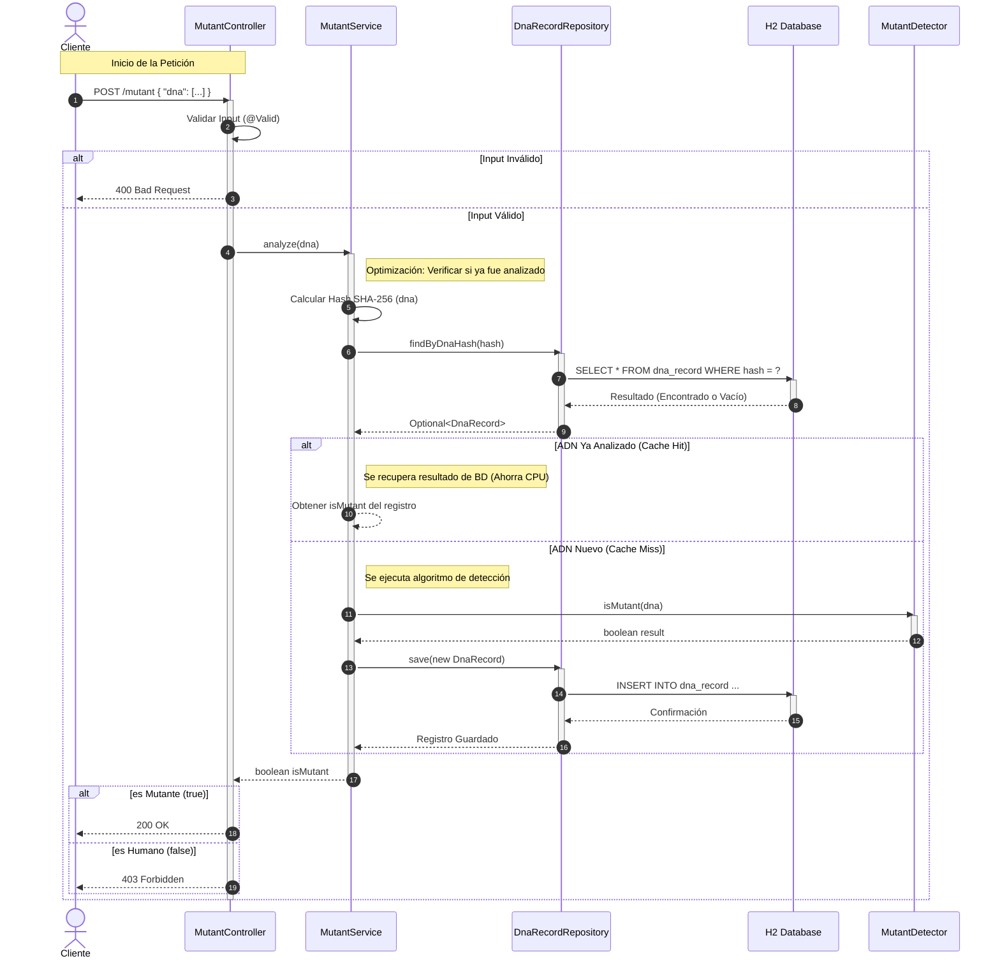

🧬 Mutant DNA Detector API

Link Render: https://globaldesarrollo-1.onrender.com

API REST para detección de mutantes mediante análisis de secuencias de ADN.
Implementado con Spring Boot, Gradle, Java 17 y H2, siguiendo arquitectura en capas.

Diagrama de Secuencia

Este diagrama muestra cómo interactúan los componentes del sistema para procesar una solicitud de análisis de ADN:

```

``` 


📌 Descripción del Proyecto

Este proyecto implementa un sistema capaz de identificar si un ADN pertenece a un mutante.

Un humano es considerado mutante si contiene al menos dos secuencias de cuatro letras iguales consecutivas (A, T, C o G) en alguna de estas direcciones:

Horizontal

Vertical

Diagonal

1️⃣ Algoritmo de Detección (isMutant)

Analiza la matriz de ADN para encontrar patrones repetidos de forma eficiente.

2️⃣ API REST

POST /mutant

GET /stats

Respuestas:

200 OK → ADN mutante

403 Forbidden → ADN humano

3️⃣ Persistencia y Estadísticas

Cada ADN se guarda en una base H2 junto a su resultado para generar estadísticas.

🛠 Tecnologías Utilizadas
Componente	Tecnología	Versión	Propósito
Lenguaje	Java	17+	Backend
Build Tool	Gradle	8.x	Construcción
Framework	Spring Boot	3.x	API REST
Persistencia	Spring Data JPA	3.x	Acceso a datos
Base de Datos	H2 Database	2.x	BD embebida
Testing	JUnit 5 / Mockito	5.x	Pruebas
Coverage	JaCoCo	0.8+	>80% de cobertura
▶️ Ejecución Local

Requisitos:

Java 17+

1. Clonar
git clone <URL_DE_TU_REPOSITORIO>
cd ExamenMercado

2. Compilar y ejecutar tests
./gradlew clean build

3. Ejecutar la API
./gradlew bootRun


La API estará disponible en:
http://localhost:8080

🌐 Endpoints
1️⃣ POST /mutant

Body (JSON):

{
  "dna": ["ATGCGA", "CAGTGC", "TTATGT", "AGAAGG", "CCCCTA", "TCACTG"]
}


Respuestas:

200 OK → Es mutante

403 Forbidden → No es mutante

2️⃣ GET /stats

Respuesta:

{
  "count_mutant_dna": 40,
  "count_human_dna": 100,
  "ratio": 0.4
}

👤 Información del Desarrollador

Nombre: Rosario Chirino

Legajo: 50847

Carrera: Ingeniería de Sistemas

Materia: Desarrollo de Software

Año: 3er Año


